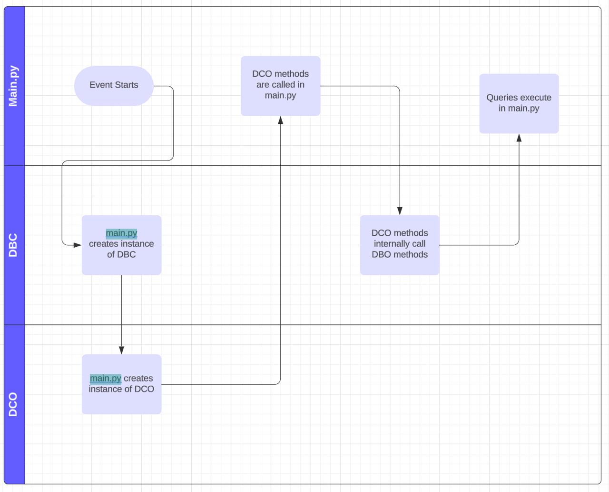

# Transparent WCPS query generation (V3)

This library provides a convenient and comprehensive way to interact with Rasdaman service through HTTP requests. It offers functionalities to build and execute queries on the server alongside retrieving and manipulating data related to the library.

## In this README :point_down:

- [Features](#features)
  - [Dependencies](#dependencies)
- [Usage](#usage)
  - [Initial setup](#initial-setup)
  - [Query Building](#query-building)
  - [Query Execution](#query-execution)
  - [Additional Classes](#additional-classes)
- [Testing](#testing)
- [FlowChart_Diagram](#flowchart_diagram)
- [Authors](#authors)

## Features

The library allows the use to query to the wcps server using the methods provided. The main purpose of the library is to convert the wcps query language to an easy and human readable set of instructions.

### Dependencies

`Python 3.x`: The library is compatible with Python 3.x versions.

`Requests`: The requests library is required for making HTTP requests to interact with the Rasdaman service.

`unittest`: The primary test suite library that is used in this project.

`pytest`: Additional test suite library that is used in this project

## Usage

### Initial setup

1. Import the `Dbc` and `Dco` classes.

_the `Dbc` class is used to set up the connection to the wcps server and the `Dco` class is used to build the queries that will be sent to the server._

2. Set up the endpoint to the wcps server. This is done through the `Dbc` class. It sets the service endpoint URL based on the provided service name (e.g., WCS), version (e.g., 2.0.1), and request type (e.g., GetCapabilities).s

```
db_connection = Dbc(service="WCS", version="2.0.1")
```

_The request parameter of the `Dbc` class defaults to None if nothing is provided_

3. If you want to send a request to the server that doesn't include a query, you can do so by passing the request type to the `Dbc` class and running the post_request method directly from the instance (you will need to provide additional parameters depending on the request type):

```
db_connection = Dbc(service="WCS", version="2.0.1", request="GetCapabilities")
result = db_connection.post_request()
```

**Note:** Available request types are: ['GetCapabilities', 'DescribeCoverage', 'GetCoverage']

4. Create an instance of the `Dco` with the `Dbc` instance set to the `dbc` parameter. This will be used to build the queries moving forward. Secondly, import the `Coverage` class and instansiate it with the coverage you wish to query. pass all instances of `Coverage` you created to `Dco`.

```
db_connection = Dbc()
coverage1 = Coverage("AvgLandTemp")
coverage2 = Coverage("AvgMeanLandTemp")
query_builder = Dco(coverage1, coverage2, dbc=dbc)
```

_Note: At least one coverage must be specified_

5. If you wish to provide a subset of the coverage, use the `AxisSubset` class. Instantiate it with the name and value you wish. Once you have all the subsets you want, pass them all to the `set_subset` method in the instance of the coverage you wish to query.

```
dbc = Dbc()
coverage = Coverage("AvgLandTemp")
dco = Dco(coverage, dbc=dbc)

lat = AxisSubset('Lat', 53.08)
lon = AxisSubset('Long', 8.80)
ansi = AxisSubset('ansi',  (Date(2014, 1), Date(2014, 12)))
coverage.set_subset(ansi, lat, lon)

```

_Note: to select a date as the value of a subset, you must use the `Date` class provided by us. Include the year and month to the class and you will receive a formatted date_

6. Now you are able to access the methods used to build and execute the queries.

_Note: each coverage is created with its own variables, allowing for complex multi variable queries_

### Query Building

**Note:** the following methods are used to build the query that is sent to the server. While some methods can be used to build isolated queries, most of these methods are used in tandem to construct more complex queries.

All methods that don't have a return value return the `Dco` instance itself to support `method chaining`

```
  return_expression(self, expression) -> Dco:
```

- **Function**: added the return statement to the query based on what expression is given.
- **parameter**: _expression_ (value that must be one of the following ['Coverage',
  'BinaryArithmeticOperation',
  'BinaryComparisonOperation',
  'int',
  'float',
  'AggregationMethod',
  'MathOperation'])
- **Purpose**: appends return statement

```
switch(self, *cases: Case, default: RGB) -> Dco:
```

- **Function**: sets up a switch query.
- **Parameters**:

  - _cases_ (list of cases): A list of cases for the switch query that must be instantiated beforehand through the `Case` class.

    **Note**: the cases must be instance with the correct condition (**BinaryComparisonOperation**) and return value (**RGB**).

  - _default_ (RGB): the return statement of the switch query (must be of type RGB).

- **Purpose**: Sets up a switch query that evaluates the cases and returns the corresponding color based on the selected case.
- **Raises**:
  `TypeError` If any of the values given are of the wrong type.

```
construct(self, values: List[Tuple[int, int]], operator: str) -> Dco:
```

- **Function**: constructs a coverage query.
- **Parameters**:
  - _values_ (list of tuples): A list of tuples representing coverages and their types. Each tuple should have two elements defining the range (start and end).
  - _operator_ (string): The operator to use in the coverage query (e.g., "+").
- **Purpose**: Constructs a coverage query with the given values and operator.
- **Raises**:
  `VariableArgumentException` If the length of tuples in values is not 2 or values are not integers.

```
 clip(self, values: List[Tuple[int, int]]) -> Dco:
```

- **Function**: constructs a query for polygon clipping.
- **Parameters**:

  - _values_ (list of tuples): A list of tuples representing the vertices of a polygon.

    Each tuple should have two elements: x and y coordinates.

- **Purpose**: Constructs a query for clipping functionality based on the provided polygon vertices.
- **Raises**:
  `VariableArgumentException` If the length of tuples in values is not 2 or values are not integers.

### Query Execution

```
execute(self, return_format: str = None) -> Union[Response, Error]:
```

- **Function**: executes the query and returns the response.
- **Parameter**:
  - _return_format_ (string, optional): The encoding format for the response data (e.g. "json").
- **Purpose**: Executes the built query and returns the response content. If the execution fails, it returns an object containing information about the error.
- **Raises**:
  `KeyError` If the format string given isn't in the allowed return format types list.

### Additional Classes

```
AggregationMethod(operation: str, expression: str)
```

- **Purpose**: A class to represent aggregation operations in WCPS queries.
- **Function**: It supports max, min, avg, sum, and count operations.
- **Parameter**:
  - _operation_ (str): The name of the operation (e.g., 'max', 'min').
  - _expression_ (str): The expression over which the operation is performed.
- **Raises**:
  `TypeError` If the expression given is of the wrong type.

```
MathOperation(operation: str, expression: str)
```

- **Purpose**: Represents arithmetic operations for expressions
- **Function**: Supporting basic and advanced mathematical functions.
- **Parameter**:
  - _operation_ (str): The name of the mathematical operation.
  - _expression_ (str): The expression to which the operation is applied, could be a single value or a comma-separated pair of values.
- **Raises**:
  `TypeError` If the expression given is of the wrong type.

_**Note:** Each method includes a docstring that details its purpose and how to use it. The functionality of the `operation` and `aggregate` methods are well documented in there respective classes_

### Execution Errors

We included a `network_wrapper` to handle any network request errors that might occur. The two that are handled are:

1. Timeout:

   - **Returns**:

   ```
         {
               "success": False,
               "error": {
                   "code": STATUS_CODE,
                   "message": "Request Failed",
                   "exceptionDetail": "Request Timeout Error"
               }
           }
   ```

2. HTTPError:

   - **Returns**:

   ```
           {
               "success": False,
               "error": {
                   "code": STATUS_CODE,
                   "message": "Request Failed",
                   "exceptionDetail": exceptionDetails,
                   "extra": extra information on why the request failed
               }
           }
   ```

## Testing

In the library, I included multiple unittests to check that the functionality of the methods is working properly. The tests are divided into two modules:

- **test_core**: Includes tests for the dbc, dco, case and coverage classes.
- **test_helper**: Includes tests for the operations classes and helper functions and is further divided into:
  - **test_error_handling**: Includes tests for type checking functions.
  - **test_operations**: Includes tests for aggregate and math operation methods.

## FlowChart_Diagram



## Authors

Philimon Ayalew

- [@philimon-reset](https://github.com/philimon-reset)

Adikhan Tuichiyev

- [@IntrovertTengri](https://github.com/IntrovertTengri)
